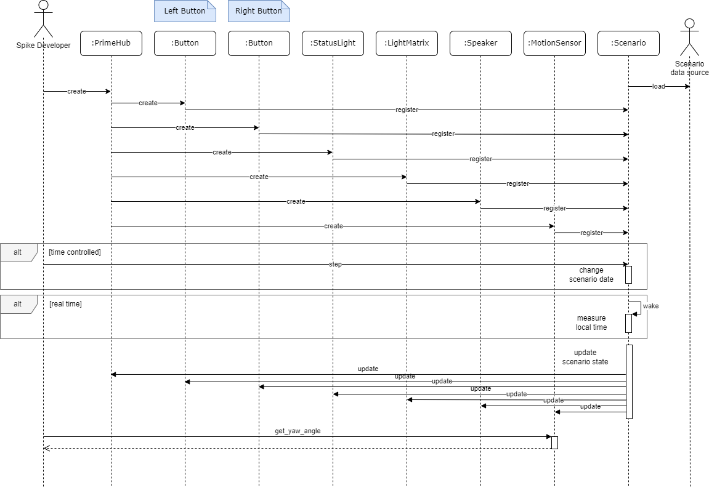
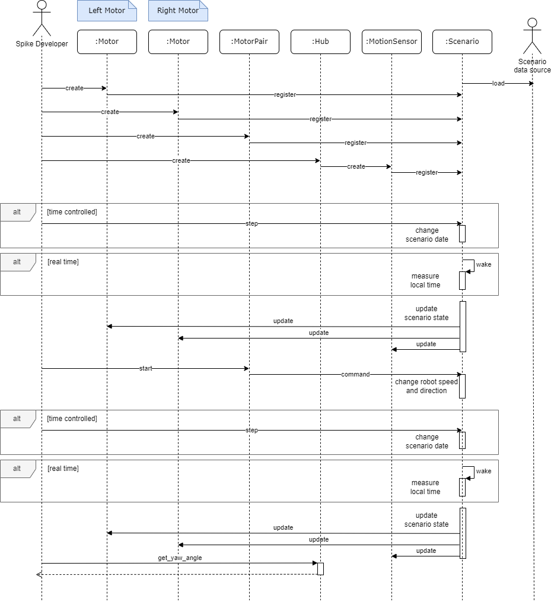
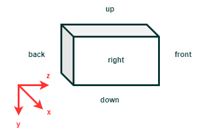

Design
======

Introduction and Goals
----------------------

The goal of the spike-mock library is to provide the spike lego developer with a way
to test his/her code on a controlled environment, where the external influences are limited
and where the synthetic world can be completely mastered.

The key requirements taken into account during the design are :

.. note::
    The spike-mock library shall offer the same interface as the spike library and be completely
    interchangeable with it.

Some additional API will be provided to configure and orchestrate the scenario flow.

.. note::
    In *read* mode, the spike-mock library shall be able to mock the spike software component
    using measurements read from an external database

In this mode, the user controls exactly the software component inputs, and the robot commands
have no impact on the software component output

.. note::
    In *computed* mode, the spike-mock library shall be able to mock the spike software
    components using a robot model to derive the impact of the robot commands on the robot
    sensors outputs

In this mode, the user commands have impact on the robot state. The library model the robot
displacement in the synthetic scene to compute the sensors measurements.

.. note::
    The spike-mock library shall be able to function in real time, as close as possible to
    the real robot behaviour

According to the documentation, lego spike components have a measurement update frequency of
100 Hz, which is the spike-library processing rate target

.. note::
    The spike-mock library shall be able to function on controlled time, providing the user
    with an interface to decidewhen time change.

This mode is useful when testing a complex tracking algorithm where logging and debugging
reduced the update rate and change algorithm performance compared to real time scenario,
hence making the debugging challenging.

Solution strategy
-----------------

Data standards
``````````````

To model the robot behavior, the library needs a description of both the robot mecanics and
the context it evolves into. To make the library more user-friendly, its configuration will
be based on as much standard as possible :

- The robot mecanics will be gathered from a `ldraw`_ model. It's the most widely used in the
  lego world and it can be easily exported from a CAD project made with the bricklink `Studio2.0`_
  tool. The main drawback is that this standard has not spread in the extended robotics world
  and will therefore require a complex transformation to use more generic robotics libraries

- The ground on which the robot eveolves will be provided as an image. The scale and coordinates
  system associated to the image will be provided in a configuration file

- The robot components data for the *read* mode will be stored in an excel workbook. Since
  spike robot scenario are limited in time, this design choice will make the library more
  user-friendly without limiting its performance.

Third parties
`````````````

- There are no well maintained open source packages for `ldraw`_ parsing. To avoid redeveloping
  a new package, the library uses a fork of python-ldraw package, which will have to be maintained
  in parallel to the library.

- There is a lot of robotics libraries providing amazing functionalities. Libraries such as
  pybullet offer very advanced functionalities but are complex to handle. Though use of
  such libraries shall be considered in future releases, for now the library will use the
  wpimath library through its robotpy python interface. It provides useful 3D geometry tools
  but does not help with the scene rendering.


Building block view
-------------------

The following image shows the layered architecture of the library


.. image:: layered-architecture.png
   :align: center

----------

Data layer description
``````````````````````

**ScenarioAbaqus** loads abaqus data from excel workbook and provides interpolation function
to extrapolate abaqus outside of its provided data range. This component is typically used to link
the motors speed command and its real rotation speed and link wheels ldraw part id to the wheel
radius. This component relies on openpyxl to parse excel workbook

**ScenarioData** loads scenario sensors measurement when in *read* mode. The link between the
data and the component to update are based on the headers : <port>_degrees for motor,
<side>_is_pressed for button,... This component relies on openpyxl to parse excel workbook and
collect data.

**ScenarioModel** loads robot parts from an ldraw model file. It then transforms their coordinates
and orientation from the ldraw coordinate system where x is right, y is down and z is front to the
more standard north, east, down reference. It then computes the position of the wheel centers which
will be used as a center point for robot movement. It derives for each part the translation
and rotation relative to this center, which will be used when the robot moves to update each part
position and orientation from the robot center displacement. This component relies on python-ldraw
to parse ldraw file.

**ScenarioTimer** is responsible for the scenario clock management. Depending on the mode (realtime
or controlled), it will update date as scenario flows. It will be used to mock spike timers.

**ScenarioGround** loads the ground image and its associated scales. It derives the color sensor
measure from the sensor position as the robot moves. It is also responsible for providing scenario
image by wrapping the robot position on the ground.

**Scenario** is the single point interface between the spike-like software components and the
previous component. It sequences them and manages the update thread updating software components in
parallel to the API call from the end-user main thread.

Compute layer description
`````````````````````````

**ScenarioPart** and its children contain description of the lego parts involved in the robot
movement. They also store dynamics information on the part, and provide functions to model their
behavior in a scenario.

**ScenarioDynamics** is responsible for the management of the robot displacement. It receives
the end-user commands, update the robot state, extrapolate the robot position along time and
derives software components measurements.

**ScenarioCommands** is dedicated to the management of the software components commands. It
receives command from the end-user through the API software components and either dispatch them
to the ScenarioDynamics object, or directly updates the components for simple functions who do not
impact other components.

**ScenarioComponents** register the API software components as they are created and check that
there compliance with the robot structure. It updates software components along time from either
data or simulated measurements depending on the mode.

Interface layer description
```````````````````````````

The objects defined in spike libraries (**Motor**, **MotorPair**, **PrimeHub**, **ColorSensor**,
**DistanceSensor**, **ForceSensor**, **LightMatrix**, **MotionSensor**, **Speaker**,
**StatusLight**, **Timer**, **Button**) are reproduced with the same API. They are nothing but
a shell to receive and dispatch data from external sources, either commands from the end-user
to the scenario or measurement from the scenario to the end-user

**Client** component provides a webclient to pilot scenario and display the robot behaviour.
It relies on flask to serve this graphical user interface.


Runtime view
------------

The following scenarios show key dynamic behaviour of the library

From interface layer to compute layer
`````````````````````````````````````

1 - Passive elements update principle
'''''''''''''''''''''''''''''''''''''

The following sequence diagram details how passive elements of the spike API are updated along time.



----------

2 - Active elements update principle
''''''''''''''''''''''''''''''''''''

A command received by a component can have impact on other components. For example, starting a
MotorPair component will change the left and right motor counted degrees and may also change
the robot orientation measured by the MotionSensor in the hub component. To handle such a scenario,
all the command received by the component that impact the robot behaviour are redirected to the
central Scenario component which will update the robot simulated state and redistribute it to all
the software components.

The following sequence diagram details how active elements interfere with the scenario to modify
the robot state and then the software components state.



----------

Inside compute layer
````````````````````

1 - Scenario parallel processing
''''''''''''''''''''''''''''''''

The following sequence diagram shows the threading principle of Scenario update and the way
it delegates responsibilities to other compute components.


2 - ScenarioDynamics and ScenarioPart interactions
''''''''''''''''''''''''''''''''''''''''''''''''''

The following sequence diagram shows how ScenarioDynamics leverages ScenarioParts to link
the command and the structure response.

Detailed description
--------------------

.. image:: parts.png
   :align: center

----------

Deployment view
---------------

The spike-mock is provided under 2 packaging :

- A python module which can be directly used through its API in a larger python code
- A docker image which can be accessed through a rest API and a web client to manage scenario from a graphical user interface (coming soon)

Concepts
--------

Coordinates systems
```````````````````

Ldraw coordinate system
'''''''''''''''''''''''

The ldraw coordinate system for robot structure description is defined as follows :



----------

The x axis of the ldraw coordinate system is oriented from left to right of the scene.

The y axis of the ldraw coordinate system is oriented from up to down.

The z axis of the ldraw coordinate system is oriented from back to front.

When modelling a robot under `Studio2.0`_, the position of the center can be anywhere in the scene.
Orientation is key, though : the front of the robot shall be the side viewed when selecting the
front orientation view to match the library requirements.
When exported a robot matching this requirements in ldraw format, the x and z axis are not
adequately oriented, which is corrected in the library.


NED coordinate system
'''''''''''''''''''''

The North-East-Down coordinate system is defined as follows :

.. image:: ned-coordinates.png
   :align: center

----------

The x axis ot the NED coordinate system is oriented north on the mat world, which is top

The y axis of the NED coordinate system is oriented east on the mat, which is right

The z axis of the NED coordinate system is oriented down.


.. _`ldraw`: https://www.ldraw.org/
.. _`Studio2.0`: https://www.bricklink.com/v3/studio/download.page
